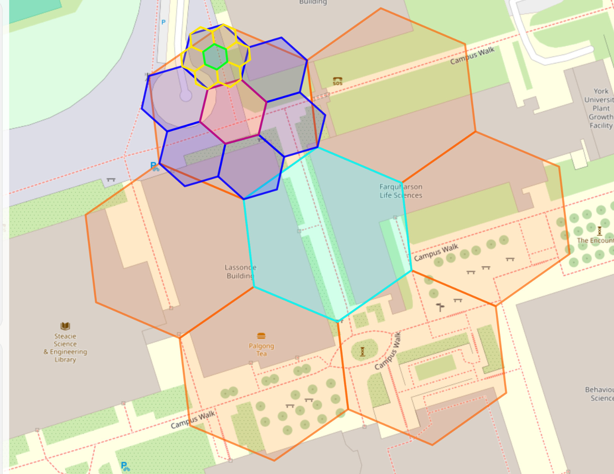

# H3xplorer | A Hexagonal Mapping Tool

H3xplorer (/hɛksˈplɔːrər/) is an open-source online tool that enables users to create, edit, and explore hexagon-based maps using Uber's H3 geo-coordinates. Designed for data scientists, urban planners, and hobbyists.

You can access the live demo here: [H3xplorer](https://faraji.info/h3xplorer/h3xplorer.html).



## Table of Contents

- [H3xplorer | A Hexagonal Mapping Tool](#h3xplorer--a-hexagonal-mapping-tool)
  - [Table of Contents](#table-of-contents)
  - [Features](#features)
  - [Getting Started](#getting-started)
    - [Prerequisites](#prerequisites)
    - [Installation (for Local Development)](#installation-for-local-development)
  - [How It Works](#how-it-works)
  - [Usage](#usage)
  - [Contributing](#contributing)
  - [License](#license)
  - [Acknowledgments](#acknowledgments)

## Features

- **Hexagonal Mapping**: Powered by Uber’s H3 technology, allowing for accurate data mapping on hexagonal grids.
- **Customizable Hexagons**: Modify individual hexagons or groups with custom colors, labels, and more.
- **Layer and Opacity Control**: Toggle between map layers and adjust opacity to enhance visual clarity.
- **Interactive Editing**: Add hexagons by clicking on the map or entering specific hex IDs for precise placement.
- **Real-time Updates**: Instantly visualize changes to hexagon properties on the map.
- **Open-Source**: Built with open-source tools, making it free to use and contribute to.

## Getting Started

To use H3xplorer, simply visit the live site: [https://faraji.info/h3xplorer/h3xplorer.html](https://faraji.info/h3xplorer/h3xplorer.html).

### Prerequisites

- **Web Browser**: H3xplorer is compatible with all modern web browsers.
- **Internet Connection**: Necessary for loading map tiles and library dependencies.

### Installation (for Local Development)

To modify or extend H3xplorer, clone the repository and open the project locally:

```bash
git clone https://github.com/alifa98/h3xplorer.git
cd h3xplorer
```

Then open `index.html` in your preferred browser.

## How It Works

H3xplorer uses Uber’s H3 library to create hexagonal grids over geospatial data, providing a versatile structure for analyzing and visualizing geo-coordinates. Users can click on the map to add hexagons or input hex IDs to populate the map with specific hexagons. Customize hexagon properties like color, opacity, and labels to effectively display your data.

## Usage

1. **Launch the Tool**: Open [H3xplorer](https://faraji.info/h3xplorer/h3xplorer.html).
2. **Add Hexagons**: Click directly on the map or enter hex IDs to populate the map with hexagons.
3. **Customize**: Adjust colors, set opacity, and add labels for each hexagon.
4. **Save or Export**: Capture screenshots or export your hex map data (feature in development).

## Contributing

Contributions are encouraged! Here’s how you can help improve H3xplorer:

1. Fork this repository.
2. Create a new branch (`git checkout -b feature/YourFeature`).
3. Commit your changes (`git commit -m "Add new feature"`).
4. Push your branch (`git push origin feature/YourFeature`).
5. Open a pull request.

## License

This project is licensed under the MIT License. See the [LICENSE](LICENSE) file for details.

## Acknowledgments

- Created by [Ali Faraji](https://faraji.info)
- Built using [Uber’s H3](https://uber.github.io/h3/) and [Leaflet](https://leafletjs.com/) libraries.
